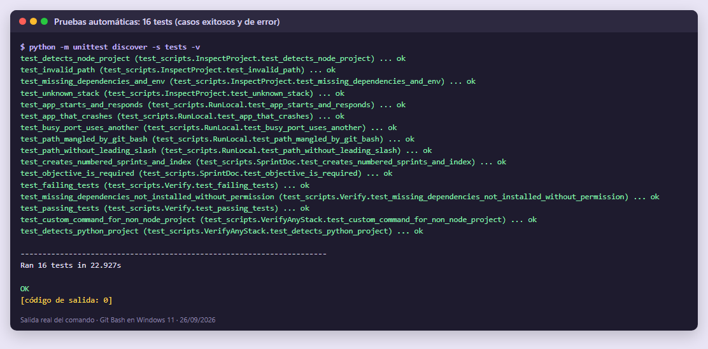
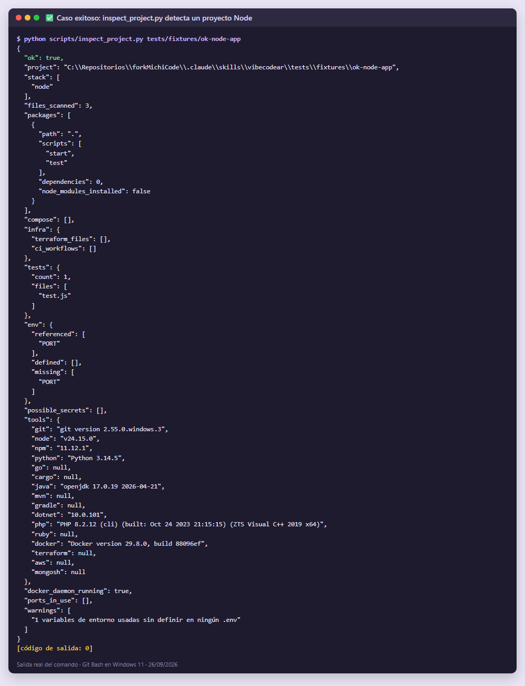
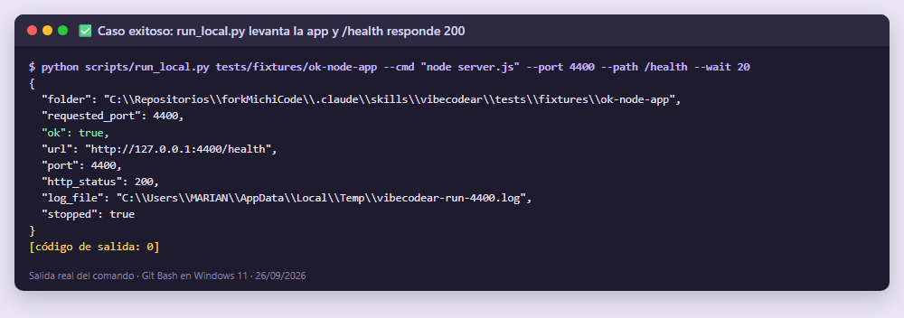
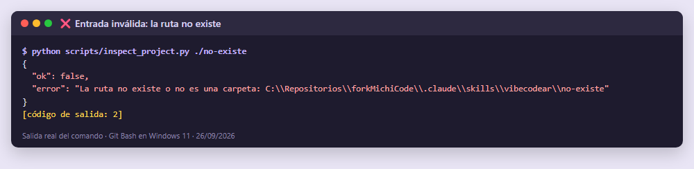
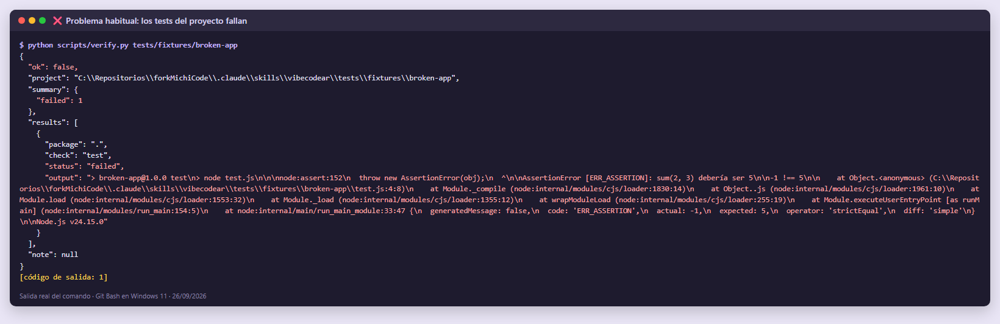
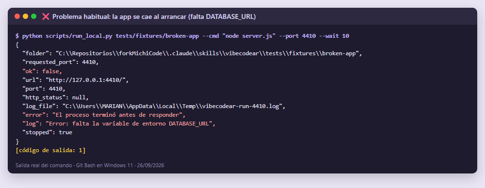
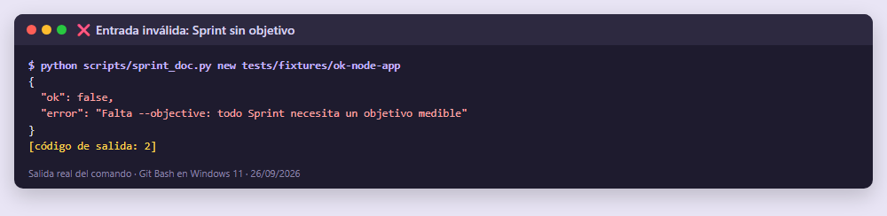
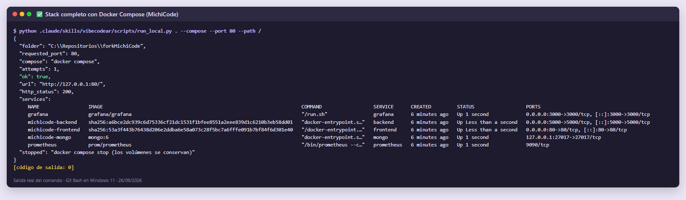

# 🧭 Vibecodear

Skill para **Claude Code** que actúa como un **Engineering Manager técnico**: entra a un proyecto existente, lo analiza, elige los roles que hacen falta (Backend, QA, DevOps, UX…), define un objetivo medible y ejecuta un **Sprint** completo, desde implementar y probar hasta ejecutar localmente, pedir feedback y documentar. Cada Sprint queda registrado en `.vibecodear/sprints/sprint-NN.md`.

Funciona con **cualquier proyecto**: detecta Node, Python, Go, Rust, Java, .NET, PHP, Ruby, Docker, Terraform, AWS y MongoDB. Si no reconoce el stack, lo dice y pregunta cómo se ejecuta en lugar de suponerlo.

## ¿Cuándo usarla?

- "Vibecodear este proyecto", "hagamos un sprint", "¿qué le falta a este repo?", "estabiliza/mejora este proyecto".
- **No** usarla para una pregunta puntual o un cambio de una línea.

## Flujo

```
Analizar → Diagnosticar → Roles → Objetivo → Plan ⛔ aprobación → Implementar
→ Probar → Ejecutar local ⛔ feedback → Documentar → Iterar
```

## Estructura

| Carpeta / archivo | Para qué | Quién lo usa |
| --- | --- | --- |
| `SKILL.md` | Flujo, puntos de control y reglas de seguridad | Claude (siempre) |
| `scripts/inspect_project.py` | Detecta stack, tests, variables de entorno, secretos, herramientas y puertos | Paso 1 |
| `scripts/verify.py` | Ejecuta build/test/lint por paquete Node, o el comando del stack con `--cmd` | Paso 7 |
| `scripts/run_local.py` | Levanta la app, maneja puertos ocupados, comprueba HTTP y la detiene | Paso 8 |
| `scripts/sprint_doc.py` | Crea `sprint-NN.md` y el índice de Sprints | Pasos 5 y 9 |
| `references/roles.md` | Señales, checklist y **enlace al roadmap** de cada rol y tecnología | Paso 3 (y al asumir cada rol) |
| `references/troubleshooting.md` | Qué hacer ante cada error habitual | Cuando hay `warnings` o fallos |
| `assets/sprint-template.md` | Plantilla del documento de Sprint | `sprint_doc.py` |
| `tests/` | Pruebas automáticas de los scripts (casos exitosos y de error) | Tú, para validar |

## Requisitos

- [Claude Code](https://claude.com/claude-code)
- Python 3.9+ (solo librería estándar; no hace falta `pip install`)
- Node.js 18+ (solo para proyectos Node y para los tests de ejemplo)
- Docker (opcional, para `run_local.py --compose`)

## Instalación

**Solo en este proyecto:** ya está instalada en `.claude/skills/vibecodear/`.

**En cualquier proyecto:** copia la carpeta a tus skills personales:

```bash
# Windows (PowerShell)
Copy-Item -Recurse .claude\skills\vibecodear $HOME\.claude\skills\vibecodear
# macOS / Linux
cp -r .claude/skills/vibecodear ~/.claude/skills/vibecodear
```

Reinicia Claude Code y comprueba que aparece con `/skills`.

## Uso

Dentro de Claude Code, en la raíz del proyecto:

```
/vibecodear
```
o en lenguaje natural: *"vibecodea este proyecto: quiero que arranque localmente"*.

Los scripts también se pueden ejecutar solos:

```bash
python .claude/skills/vibecodear/scripts/inspect_project.py .
python .claude/skills/vibecodear/scripts/verify.py .                          # proyectos Node
python .claude/skills/vibecodear/scripts/verify.py . --cmd "python -m pytest" # cualquier stack
python .claude/skills/vibecodear/scripts/run_local.py . --cmd "npm run dev" --port 5000 --path /health
python .claude/skills/vibecodear/scripts/run_local.py . --compose --port 80          # todo el stack con Docker
python .claude/skills/vibecodear/scripts/sprint_doc.py new . --objective "El backend responde en /health"
python .claude/skills/vibecodear/scripts/sprint_doc.py list .
```

## Ejemplo real de entrada y resultado

Ejecución real sobre este repositorio (MichiCode: React + Express + MongoDB + Docker), en la que la usuaria había perdido sus archivos `.env`.

**Entrada (en Claude Code):**
```
/vibecodear la prioridad es que pueda levantar de manera local y que funcionen sus
funcionalidades [...] olvidé el contenido de mis archivos .env del proyecto, dame una
propuesta de solución
```

**1. Análisis.** `inspect_project.py` devolvió (extracto real; solo nombres de variables, nunca valores):

```json
{
  "ok": true,
  "stack": ["aws", "docker", "docker-compose", "express", "github-actions",
            "mongodb", "node", "react", "terraform", "typescript"],
  "tests": { "count": 0, "files": [] },
  "env": { "missing": ["API_BASE", "DOCKER_USER", "EC2_HOST_DNS"] },
  "possible_secrets": ["backend/src/server.ts:16"],
  "docker_daemon_running": false,
  "warnings": [
    "Dependencias no instaladas en backend (falta node_modules)",
    "Dependencias no instaladas en frontend (falta node_modules)",
    "3 variables de entorno usadas sin definir en ningún .env",
    "No se encontraron archivos de test",
    "1 posibles secretos escritos en el código",
    "El proyecto usa terraform pero 'terraform' no está instalado",
    "El proyecto usa aws pero 'aws' no está instalado"
  ]
}
```

**2. Diagnóstico, roles y objetivo.** Claude verificó, sin mostrar valores, que los `.env` locales eran coherentes con `docker-compose.yml`. Detectó que faltaban plantillas `.env.example` y que Mongo no se publicaba al host. Activó **DevOps, Backend y QA** y propuso el objetivo *"con `docker compose up --build` el frontend responde en `http://localhost` y la API cumple `POST /shorten` 201, `GET /<code>` 301, `GET /<code>/qr` 200 y `GET /urls` 200"*. ⛔ Esperó la aprobación de la usuaria antes de tocar nada.

**3. Resultado.** Se implementó, se probó y se levantó el stack. La usuaria validó la app y el Sprint quedó documentado:

| Comprobación | Resultado |
| --- | --- |
| `GET http://localhost/` (frontend) | 200 |
| `POST /shorten` | 201 |
| `GET /<code>` | 301 → URL original |
| `GET /<code>/qr`, `GET /urls` | 200 |
| Estado del Sprint | ✅ Cumplido |

```
.vibecodear/
├── README.md            # índice: Sprint | Objetivo | Estado
└── sprints/
    ├── sprint-01.md     # recuperar el entorno local (.env.example, Mongo, pruebas)
    └── sprint-02.md     # rediseño de la UI con iteración tras el feedback
```

Documentos completos: [sprint-01.md](../../../.vibecodear/sprints/sprint-01.md) y [sprint-02.md](../../../.vibecodear/sprints/sprint-02.md). El segundo muestra un **ciclo de feedback**: la primera entrega se rechazó y el Sprint se iteró hasta cumplirse.

## Pruebas

```bash
cd .claude/skills/vibecodear
python -m unittest discover -s tests -v
```

Resultado esperado: `Ran 16 tests ... OK`. En Linux o macOS aparece `OK (skipped=1)`, porque el test de Git Bash solo corre en Windows.

| Caso | Tipo | Resultado esperado |
| --- | --- | --- |
| Proyecto Node válido (`fixtures/ok-node-app`) | ✅ Éxito | Detecta stack, tests pasan, la app responde 200 en `/health` |
| Ruta que no existe | ❌ Entrada inválida | `ok: false`, código de salida 2 |
| Carpeta sin stack reconocible | ❌ Stack desconocido | `stack: ["unknown"]` |
| Dependencias sin instalar | ❌ Problema habitual | `missing_dependencies`, **no** instala sin permiso |
| Test que falla (`fixtures/broken-app`) | ❌ Tests fallando | `failed` con la salida del error |
| App que se cae al arrancar | ❌ No inicia | `ok: false` y log con la causa (`DATABASE_URL`) |
| Puerto ocupado | ❌ Problema habitual | Usa otro puerto libre y lo avisa |
| `--path health` (sin `/` inicial) | ✅ Entrada tolerada | Normaliza a `/health` |
| `--path /health` escrito en Git Bash (Windows) | ❌ Problema habitual | MSYS lo convierte en `C:/Program Files/Git/health`; el script lo detecta y lo corrige |
| Proyecto Python con carpeta `tests/` | ✅ Otro stack | Detecta `python` y cuenta el test |
| Tests de otro stack con `--cmd` | ✅ Otro stack | Ejecuta el comando indicado y da `passed` |
| Sprint sin objetivo | ❌ Entrada inválida | Error: "Falta --objective" |
| Dos Sprints seguidos | ✅ Éxito | Crea `sprint-01.md`, `sprint-02.md` y el índice |

Además, `run_local.py --compose` reintenta `docker compose up` si Docker Desktop aún está arrancando, y usa `docker-compose` si el plugin no responde. Esto se probó a mano con el stack real, porque requiere Docker (captura 8).

### Capturas

Salidas reales de los comandos (Git Bash en Windows 11), guardadas en [`docs/capturas/`](docs/capturas/):

| # | Caso | Captura |
| --- | --- | --- |
| 1 | Suite completa: 16 tests OK |  |
| 2 | ✅ `inspect_project.py` detecta un proyecto Node |  |
| 3 | ✅ `run_local.py` levanta la app y `/health` responde 200 |  |
| 4 | ❌ Ruta que no existe → `ok: false`, salida 2 |  |
| 5 | ❌ Tests del proyecto fallan → `failed` con el error |  |
| 6 | ❌ La app se cae al arrancar → log con la causa |  |
| 7 | ❌ Sprint sin objetivo → error y no escribe nada |  |
| 8 | ✅ Stack completo con Docker Compose (MichiCode) → 200 |  |

## Seguridad

- No muestra valores de `.env` ni secretos (solo nombres y `archivo:línea`).
- Pide confirmación antes de instalar dependencias, borrar, hacer `git push`, `terraform apply`, `docker compose down -v` o cualquier deploy.
- `run_local.py` solo detiene lo que él mismo levantó.
